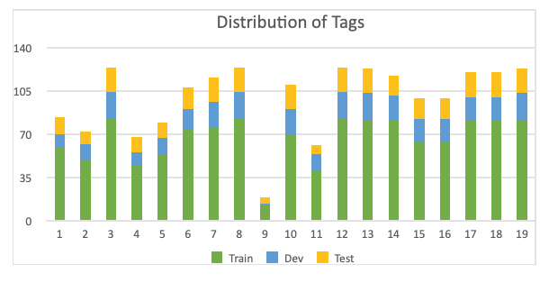

## Bidding Documents for Information Extraction

### Problem

Given a document and a list of pre-defined tags, the system extracts corresponding information from
the document to each tag.

For this dataset, the list of pre-defined tags are:

| No. | Tag Name (JP) | Tag Name (EN) | Value Type | Description |
| --- |------|------|---|---|
| 1 | 調達年度 | Year of Procurement | datetime (year only) |   |
| 2 | 都道府県 | Prefecture | text |   |
| 3 | 入札件名 | Bid Subject | text |   |
| 4 | 施設名 | Facility Name | text |   |
| 5 | 需要場所(住所) | Address for Demand | text |   |
| 6 | 調達開始日 | Start Date of Procurement | datetime |   |
| 7 | 調達終了日 | End Date of Procurement | datetime |   |
| 8 | 公告日 | Public Announcement Date | datetime |   |
| 9 | 質問票締切日時 | Deadline for Questionnaire | datetime |   |
| 10 | 資格申請締切日時 | Deadline for Applying Qualification | datetime |   |
| 11 | 入札書締切日時 | Deadline for Bidding | datetime |   |
| 12 | 開札日時 | Opening Application Date | datetime |   |
| 13 | 質問箇所 所属/担当者 | PIC for Inquiry of Questions | text |   |
| 14 | 質問箇所 TEL/FAX | TEL/FAX for Inquiry of Questions | text |   |
| 15 | 資格申請送付先 | Address for Submitting Application | text |   |
| 16 | 資格申請送付先 部署/担当者名 | Department/PIC for Submitting Application | text |   |
| 17 | 入札書送付先 | Address for Submitting Bid | text |   |
| 18 | 入札書送付先 部署/担当者名 | Department/PIC for Submitting Bid | text |   |
| 19 | 開札場所 | Place of Opening Bid | text |   |

Note: \
The tag names in correct answer (excel files) may be different from the list above. It is suggested 
that you use the below line to **_normalize_** the tags read from those excel files.
```buildoutcfg
import unicodedata
import re

tag = unicodedata.normalize("NFKC", re.sub('＊|\*|\s+', '', tag))
```

### Dataset

#### Overview

- Total number of documents: 124
- Train: 82
- Dev (Public Test): 22
- Test (Private Test): 20

#### Data Collection and Processing

We collected 124 public Japanese bidding documents from the Japan Oil, Gas and Metals National Corporation [JOGMEC](http://www.jogmec.go.jp/news/bid/search.php). Each document is a public notice, which outlines the information about the bidding process, including the dates of the contract, the deadlines for submission, and the contacts of the department or person in charge. These documents are raw texts, so we need to define a set of tags for the annotation process. To do that, we consulted our legal team for the definition. The discussion and definition were internally conducted. Finally, we defined 19 names that represent the categories of extracted information, which we formally refer to as `tags`. The list of tags covers common important information of a bidding document. The list is unique and remains unchanged in all three train/dev/test sets.

The next step is to parse the collected documents. This is because the collected documents are in the PDF format, so it needs to be converted to the text format for facilitating the annotation process. To do that, we build a document reader library to parse the original documents in the PDF format into structured texts. The document reader bases on [pdfplumber](https://github.com/jsvine/pdfplumber), which is a python-based library for extracting text characters, rectangles, lines, and tables from a PDF file. The document reader utilizes the position of characters in the original document to get the exact text of a line or paragraph. However, the original pdfplumber tool can not output texts in a structure, e.g. lines, paragraphs. To address this issue, we defined a handful of rules based on the bullets, numberings, indentation of a text line to construct the hierarchical structure of texts as appeared in the original text. The reason for keeping the hierarchical structure of texts is to facilitate IE models by taking advantage of context information.

#### Distribution of Tags



Note: the number on x-axis corresponds to tag number in the table above.

#### Interpretation of Correct Answer files

| Column Name | Description |
| ----- | ------ |
| Page No | page number in which the text line appears |
| Text | text line as appeared in the original document |
| Index | index of each text line, starting from 1 |
| Parent Index | refer to the index of its immediate title as appeared in the original document |
| Is Title | whether the current text line is a title or not |
| Is Table | whether the current text line is in a table or not |
| Tag | name of tag(s) in the current text line |
| Value | extracted value from the current text line |

Note: \
If there are multiple tags and CAs in the same line: 
- semicolons `;` are used to separate different tags and different CAs
- the number of tags = the number of CAs \
(for cases where the number of tags != the number of CAs, it is certain
that the number of tags in that line = 1 or the number of CAs in that line = 1)

