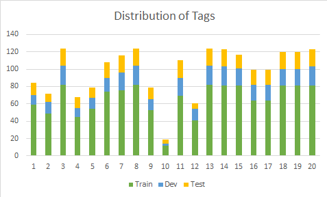

## Bidding Documents for Information Extraction

### Problem

Given a document and a list of pre-defined tags, the system extracts corresponding information from
the document to each tag.

For this dataset, the list of pre-defined tags are:

| No. | Tag Name (JP) | Tag Name (EN) | Value Type | Description |
| --- |------|------|---|---|
| 1 | 調達年度 | Year of Procurement | datetime (year only) |   |
| 2 | 都道府県 | Prefecture | text |   |
| 3 | 入札件名 | Bid Subject | text |   |
| 4 | 施設名 | Facility Name | text |   |
| 5 | 需要場所(住所) | Address for Demand | text |   |
| 6 | 調達開始日 | Start Date of Procurement | datetime |   |
| 7 | 調達終了日 | End Date of Procurement | datetime |   |
| 8 | 公告日 | Public Announcement Date | datetime |   |
| 9 | 仕様書交付期限 | Deadline for Delivery of the Specification | datetime |   |
| 10 | 質問票締切日時 | Deadline for Questionnaire | datetime |   |
| 11 | 資格申請締切日時 | Deadline for Applying Qualification | datetime |   |
| 12 | 入札書締切日時 | Deadline for Bidding | datetime |   |
| 13 | 開札日時 | Opening Application Date | datetime |   |
| 14 | 質問箇所 所属/担当者 | PIC for Inquiry of Questions | text |   |
| 15 | 質問箇所 TEL/FAX | TEL/FAX for Inquiry of Questions | text |   |
| 16 | 資格申請送付先 | Address for Submitting Application | text |   |
| 17 | 資格申請送付先 部署/担当者名 | Department/PIC for Submitting Application | text |   |
| 18 | 入札書送付先 | Address for Submitting Bid | text |   |
| 19 | 入札書送付先 部署/担当者名 | Department/PIC for Submitting Bid | text |   |
| 20 | 開札場所 | Place of Opening Bid | text |   |

Note: \
The tag names in correct answer (excel files) may be different from the list above. It is suggested 
that you use the below line to **_normalize_** the tags read from those excel files.
```buildoutcfg
import unicodedata
import re

tag = unicodedata.normalize("NFKC", re.sub('＊|\*|\s+', '', tag))
```

### Dataset

#### Overview

- Total number of documents: 124
- Train: 82
- Dev (Public Test): 22
- Test (Private Test): 20

#### Distribution of Tags



Note: the number on x-axis corresponds to tag number in the table above.

#### Interpretation of Correct Answer files

| Column Name | Description |
| ----- | ------ |
| Page No | page number in which the text line appears |
| Text | text line as appeared in the original document |
| Index | index of each text line, starting from 1 |
| Parent Index | refer to the index of its immediate title as appeared in the original document |
| Is Title | whether the current text line is a title or not |
| Is Table | whether the current text line is in a table or not |
| Tag | name of tag(s) in the current text line |
| Value | extracted value from the current text line |

Note: \
If there are multiple tags and CAs in the same line: 
- semicolons `;` are used to separate different tags and different CAs
- the number of tags = the number of CAs \
(for cases where the number of tags != the number of CAs, it is certain
that the number of tags in that line = 1 or the number of CAs in that line = 1)

